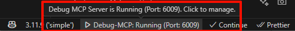
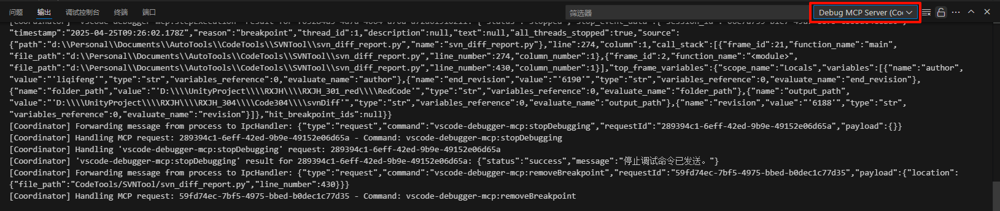

# VSCode Debugger MCP

[](https://marketplace.visualstudio.com/items?itemName=Albro3459.mcp-vscode-debugger)

This is a VS Code extension designed to enable AI agents to interact with VS Code's debugging capabilities through a Model Context Protocol (MCP) server, achieving an automated and intelligent debugging experience. 

## 📌 Fork Information

This project is a fork of [NyxJae/VsCodeDebugger-MCP](https://github.com/NyxJae/VsCodeDebugger-MCP).

The maintained fork is available at [Albro3459/VsCodeDebugger-MCP](https://github.com/Albro3459/VsCodeDebugger-MCP).

[@Albro3459](https://github.com/Albro3459) updated this project by forking the original repo, updating MCP support and versions, and applying additional minor fixes.

## ✨ Features

*   **🤖 AI-Driven Debugging**:
    *   Allows AI agents to perform standard VS Code debugging operations through the MCP tool interface.
    *   **Debug Configurations**: Reads the project's `launch.json` file to get available debug configurations.
    *   **Breakpoint Management**: Set, remove, and query breakpoints, supporting regular breakpoints, conditional breakpoints, hit count breakpoints, and log points.
    *   **Execution Control**: Start debugging sessions (`launch` or `attach` mode), continue execution (`Continue`), step through code (`Step Over`, `Step Into`, `Step Out`), and stop debugging sessions.
    *   **(Future)** Inspect variable values, traverse the call stack, evaluate expressions in specific contexts, etc.
*   **⚙️ MCP Server Management**:
    *   **Status Bar Integration**: Displays the real-time running status of the MCP server in the VS Code status bar (e.g., "Debug-MCP: Running" or "Debug-MCP: Stopped").
    *   **Convenient Control**: Click the status bar item to quickly start or stop the MCP server.
    *   **Port Configuration**: Automatically detects port occupancy. If the default port is occupied, allows the user to manually specify a new port number, which is saved to VS Code settings.
    *   **Auto Start**: Configurable option to automatically start the MCP server when VS Code launches, saved to VS Code settings.
    *   **Client Configuration**: Provides a one-click copy function to easily copy the configuration information (such as URL, port) required to connect to this MCP server to AI clients (e.g., Claude CLI/Desktop, Codex CLI/Desktop, RooCode, Cline, Cursor, etc.).
*   **📡 Communication Protocol**:
    *   The VS Code extension communicates with the local MCP server via subprocess and IPC.
    *   The MCP server supports **Streamable HTTP** (`/mcp`) and **SSE fallback** (`/sse` + `/messages`).

## 🚀 Requirements

*   **Visual Studio Code**: ^1.109.0 or higher.
*   **Node.js**: ^18.0.0 or higher (for running the MCP server).
*   **How to Install Node.js**: Please visit the [Node.js official website](https://nodejs.org/) to download and install the version suitable for your operating system.
*   **AI Client**: An AI agent client that supports the Model Context Protocol.

## 📖 Usage Guide

* First, search and install the extension in the VS Code Extensions Marketplace. `mcp-vscode-debugger`

### Connect from Claude or the RooCode Extension

1. Click the extension on the VSCode bottom bar. (`Debug-MCP: Status`)
2. Choose `Copy MCP Config...`.
3. Select `Claude JSON` for Claude, or `VSCode JSON` for RooCode.
4. Paste the copied JSON block into your agent's or workspace's config file.
    * Claude Code CLI/Desktop app: `~/.claude.json`, `~/.claude/settings.json`, or `.mcp.json` 
    * VSCode workspace (RooCode): `.vscode/mcp.json`
5. Click the extension on the VSCode bottom bar again.
6. Choose `Start Debug MCP Server`.
7. Confirm that the MCP server is running. 

    
8. Restart Claude/RooCode agent and verify it connects to `mcp-vscode-debugger`.

### Connect from Codex

1. Click the extension on the VSCode bottom bar. (`Debug-MCP: Status`)
2. Choose `Copy MCP Config...`.
3. Select `Codex TOML`.
4. Paste the copied TOML block into your Codex `~/.codex/config.toml`.
5. Click the extension on the VSCode bottom bar again.
6. Choose `Start Debug MCP Server`.
7. Confirm that the MCP server is running. 

    
8. Restart Codex (if already running) and verify it connects to `mcp-vscode-debugger`.

### MCP Client Config

The MCP server must already be running before you start your agent.

This extension provides one copy action with a format dropdown in the server actions menu:

- `Copy MCP Config...` -> `Claude JSON`: Copies JSON format MCP config for Claude Code CLI/Desktop.
    * Claude Code CLI/Desktop app: `~/.claude.json`, `~/.claude/settings.json`, or `.mcp.json` 
    ```json
    {
      "mcpServers": {
        "mcp-vscode-debugger": {
          "url": "http://127.0.0.1:6009/mcp"
        }
      }
    }
    ```
- `Copy MCP Config...` -> `Codex TOML`: Copies TOML format MCP config for Codex `~/.codex/config.toml`
    ```toml
    [mcp_servers.mcp-vscode-debugger]
    url = "http://127.0.0.1:6009/mcp"
    ```
- `Copy MCP Config...` -> `VSCode JSON`: Copies JSON format MCP config for VSCode workspace (RooCode): `.vscode/mcp.json`
    ```json
    {
      "servers": {
        "mcp-vscode-debugger": {
          "type": "http",
          "url": "http://127.0.0.1:6009/mcp"
        }
      }
    }
    ```

Important: use `127.0.0.1`, do **not** use `localhost`.

## 🔧 Extension Settings

This extension contributes the following VS Code settings:

*   `mcp-vscode-debugger.server.port` (number): The port number the MCP server listens on. Defaults to `6009`.
*   `mcp-vscode-debugger.server.autoStart` (boolean): Whether to automatically start the MCP server when VS Code launches. Defaults to `true`.

When you use the status bar menu to change the port or auto-start behavior, the extension updates workspace settings when a workspace is open, otherwise it updates your global user settings.

Example:

```json
{
  "mcp-vscode-debugger.server.port": 6009,
  "mcp-vscode-debugger.server.autoStart": true
}
```

## 🐞 Known Issues / Potential Issues

*   Only tested with the Claude/Codex external-agent flow and the VSCode RooCode client.
*   It is recommended to use project configuration instead of global configuration. First, it is easy to manage. Different projects can use different ports. Second, when debugging VSCode plug-in projects, the debug host window will be opened, resulting in multiple AI clients, causing session ID conflicts.
*   Transport mode is selected by the first request and then locked until restart:
    *   Claude/Codex external-agent first request selects `Streamable HTTP`.
    *   RooCode first request selects `SSE`.
    *   Switching mode requires restarting the MCP server.
    *   This is an architectural issue.

### Logs and Error Information

If you find errors, you can view the logs in the VS Code Output panel for easier feedback and issue reporting.
*   MCP Server Logs: 
*   Extension and Simulated Client Logs: 

## 🔮 Future Development Plan

*   **Variable and Scope Inspection**:
    *   Implement `get_scopes` tool: Get scopes (e.g., local variables, global variables) for a specified stack frame.
    *   Implement `get_variables` tool: Get a list of variables and their values for a specified scope or expandable variable.
*   **Expression Evaluation**:
    *   Implement `evaluate_expression` tool: Evaluate an expression in the context of a specified stack frame.
*   **Simultaneous HTTP SSE and Streamable Support**
    *   Due to architectural design issues, the MCP server can only support one HTTP protocol and has to be restarted to switch.
    *   Implement sweeping architectural changes to support both communication modes at the same time.
